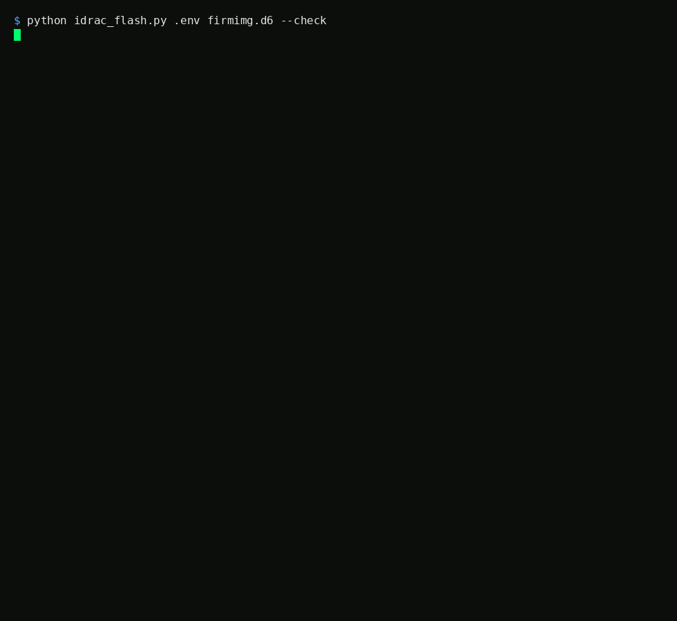

# iDRAC6 Firmware Update via Web-Upload (TFTP Workaround)

A single script that flashes iDRAC6 firmware over HTTPS/TLS 1.0, bypassing
the broken TFTP client found in old iDRAC6 firmware (observed on 1.98,
likely other early revisions too). No browser, no Java Web Start, no TFTP
server required, and no babysitting either: it logs in, uploads, triggers
the flash, watches it through the reboot, and then verifies the running
firmware actually changed to the version that was flashed.



## Usage

1. Extract the `.d6` firmware image from Dell's `.EXE` package (the ESM/
   iDRAC firmware download; 7-Zip or a similar archive tool can usually
   pull `payload/firmimg.d6` straight out of it, or run the `.EXE` on
   Windows and grab it from the extraction temp folder).
2. Copy `.env.example` to `.env` and fill in your iDRAC's IP, username, and
   password (`key:value` format, one per line, not `KEY=VALUE`).
3. Run it:
   ```
   python idrac_flash.py .env firmimg.d6
   ```

Example output:

```
=== idrac_flash.py 1.5.0 ===
Image: firmimg.d6 (56.8 MB) -> 192.168.1.100:443
Image SHA-256: 3f2a...c91b
Logging in...
Login OK.
Current firmware (before): 1.98 (Build 06)
Uploading firmware image (this can take a few minutes)...
Uploading... 10%
Uploading... 20%
...
Upload complete in 178s.
Waiting for image to be staged...
Image staged and validated. Target version: 2.92 (Build 05)
Triggering flash commit...
Flash commit accepted. Flashing now; the iDRAC will reboot itself...
fwProgress=30 state=4
fwProgress=70 state=4
iDRAC stopped responding; it's rebooting into the new firmware now.
Waiting for the iDRAC to come back online (this can take a few minutes)...
...still rebooting (30s elapsed)
...still rebooting (60s elapsed)
=== iDRAC is back online. ===
Firmware before update: 1.98 (Build 06)
Firmware after update:  2.92 (Build 05)
Target (staged image):  2.92 (Build 05)
Total run time: 412s
Verification: SUCCESS - running firmware matches the flashed image.
```

The script exits `0` only on a verified success (the post-reboot version
matches the image that was staged). It exits non-zero and says so if the
upload or the flash commit is rejected, if the iDRAC never reboots, or if it
comes back on the wrong version, so you never get a false "done" on a flash
that did not actually take. Full detail (every request/response) also goes to
`idrac_flash_log.txt` next to the script.

Before uploading it prints the SHA-256 of the `.d6` file so you can check it
against Dell's published checksum for the firmware package.

If your iDRAC's web interface is on a non-standard port, add a `port:` line
to the env file (default is 443). The poll intervals and timeouts can be
overridden with `IDRAC_*` environment variables if you ever need to (see the
top of the script).

The upload is only accepted if the iDRAC reports back at least as many bytes
as the image you sent (a partial transfer, the exact TFTP failure this tool
exists to route around, is caught and aborts instead of flashing a truncated
image). If the iDRAC's update semaphore is non-zero when you start (another
update in progress, or a stale lock from an earlier aborted attempt), the
flash aborts by default; clear it with `racadm racreset`, or pass `--force`
to flash anyway.

### Check first (read-only)

Before flashing, you can confirm the script can talk to your iDRAC and see
what firmware it's on, without uploading or changing anything:

```
python idrac_flash.py .env --check
```

This logs in, reads the session token and the running firmware version, and
exits. Nothing is uploaded or flashed. Example:

```
=== idrac_flash.py 1.5.0 --check (read-only, no flash) ===
Target: 192.168.1.100:443
Logging in...
Login OK (ST2 session token).
Current firmware (before): 2.92 (Build 05)
Update semaphore: not reported by this firmware
Read-only check complete: login, session token and version read all OK.
```

### Firmware dialects

iDRAC6's web API changed slightly across firmware. Old 1.9x revisions accept
the session cookie alone and report the running version in `spfwVer`; newer
2.x revisions require the `ST2` session token (from the login response) as a
request header and report the version in `fwVersion`. The script detects and
uses whichever the iDRAC presents, so it works on both. This was reverse
engineered from real captured traffic, not guessed; `tests/capture_idrac.py`
is a read-only tool that records how your own iDRAC answers, so you can check
it against your revision.

Only tested against an iDRAC6 Enterprise card so far (1.98, 2.85, 2.92). If
you hit something odd on an Express card or another firmware revision,
`--check`'s output plus `tests/capture_idrac.py`'s output are the two things
that actually help track it down, please open an issue with those attached
(there's a bug report template that asks for exactly that).

On 2.x firmware the upload has two more real requirements, both found by
capturing a working browser upload and both easy to get wrong: the upload
`POST` must carry the session token as a `?ST1=<token>` query parameter (a
plain form post can't set the header the `/data` calls use), and the
multipart boundary must be a long, browser-style one. A short boundary makes
the iDRAC's Appweb buffer the whole body against a ~6 MB request-body limit
and return HTTP 500 partway through the upload; a long boundary routes it to
the streaming upload handler with no such limit. The script does both.

### Optional: back up the current config first

`idrac_flash.py` always sends `preConfig=on`, which keeps your iDRAC's
configuration through the flash, but that's preservation during the flash,
not a backup you could restore from later. `idrac_backup_config.py` is a
separate, optional script that reads the current config over SSH
(`racadm getconfig -g <group>` for network, users, RAC security tuning,
serial/console, SNMP and IPMI settings) and saves it to a local text file,
so you have your own copy before touching firmware. Run it on its own:

```
python idrac_backup_config.py .env backup.cfg
python idrac_flash.py .env firmimg.d6
```

or let `idrac_flash.py` call it for you with `--backup`:

```
python idrac_flash.py .env firmimg.d6 --backup
```

`--backup` just shells out to `idrac_backup_config.py` as a separate process
before flashing (same envfile, default output filename); it's voluntary and
kept as a subprocess call rather than an import so `idrac_flash.py` itself
still has no third-party dependency, only the backup script does. If the
backup fails (e.g. paramiko missing or SSH login rejected), the flash is
aborted with that script's error message; run without `--backup` to skip the
check entirely.

This is the one script in the repo with a dependency: it talks racadm over
SSH instead of the web interface, which needs `paramiko==2.11.0` specifically
(newer paramiko versions are known to fail against iDRAC6's old SSH
algorithms). Install it with:

```
pip install paramiko==2.11.0
```

It's a best-effort plain-text snapshot for human reference and disaster
recovery, not a restorable Lifecycle Controller export (iDRAC6 predates that
feature). If a config group comes back empty or errors, the script warns you
and names the group, since your firmware revision may use slightly different
group names than the ones this script checks by default. On POSIX the backup
file is written with `0600` (owner-only) permissions, since it contains your
network, user, SNMP and IPMI configuration.

**Note:** the script confirms the iDRAC card itself came back online with
the new firmware. It does *not* check the host server's power state. An
iDRAC firmware flash only affects the management card, not the server
chassis, so there's nothing for it to check there. If you separately care
whether the server stayed powered off/on through this (e.g. because you're
away and don't want to come home to a server that turned itself on), check
that on your own via `racadm serveraction powerstatus` over SSH; that's a
different auth path (SSH/racadm, not this script's web/HTTPS one) and
outside the scope of this repo.

`idrac_flash.py` itself has no third-party dependencies; it uses only Python's
standard library (`ssl`, `socket`, `re`, `hashlib`, `urllib.parse`). The
optional `idrac_backup_config.py` is the only script that needs one
(`paramiko`), and only when you actually run it.

## Testing

The `tests/` folder ships a small mock iDRAC server so the whole flow can be
exercised without real hardware or network access:

```
bash tests/run_test.sh
```

It generates a throwaway self-signed cert, then runs `idrac_flash.py` against
the mock through the happy path plus the failure cases (rejected commit,
post-reboot version mismatch, truncated upload, non-zero update semaphore with
and without `--force`, `--backup`, wrong password, unreachable host) and
checks the exit code of each.

`idrac_backup_config.py` has its own test in the same style, against a mock
SSH/racadm shell instead of a mock web server (needs `paramiko==2.11.0`),
covering the happy path, the indexed `cfgUserAdmin` group, an empty-group
warning, and slow blockwise output that arrives in chunks:

```
bash tests/run_test_backup.sh
```

## The problem

The documented way to update an iDRAC6's firmware is:

```
racadm fwupdate -g -u -a <ip> -d payload
```

This tells the iDRAC to pull the firmware image via TFTP from a server you
run. On old iDRAC6 firmware (this was tested on 1.98, on a Dell PowerEdge
R710 with an 11G iDRAC6 Enterprise card) this **reproducibly fails partway
through the transfer**, aborting after roughly 2.6-5.0 MB out of a ~57 MB
image (`ESM_Firmware_*_A00.EXE` extracted to `firmimg.d6`).

This happens regardless of:
- which TFTP server you use (a custom Python server and Tftpd64 v4.70 both
  showed the identical abort point)
- transfer speed or added artificial delay per block (tested up to 129s
  patience per block, 40 retries, and a 4ms/block throttle — none of it
  helped)
- local firewall rules (an explicit allow rule for the TFTP port made no
  difference)
- VPN/network security software running on the client (stopping all VPN
  services made no difference)
- resetting the iDRAC's network stack (`racadm racreset`)

That ruled out the client machine, the network path, and the TFTP server
implementation. It points to a bug/limitation in the TFTP client baked into
the old iDRAC6 firmware itself for transfers of this size. This is a
long-standing, apparently under-documented issue on very old 11G iDRACs.

No harm was done by any of these failed attempts — each abort was cleanly
discarded by the iDRAC and the firmware version stayed unchanged.

## The workaround that works

The iDRAC6 web UI has its own upload path (`fwupload.esp`) that goes over
plain HTTPS instead of TFTP, and it works fine even for the full-size image.
The catch: the iDRAC6's embedded webserver (Mbedthis-Appweb/2.4.2) only
speaks TLS 1.0 with very old cipher suites. Modern browsers refuse this
outright (`ERR_SSL_VERSION_OR_CIPHER_MISMATCH`), but a raw Python socket
with an explicit low `SECLEVEL` and `TLSv1` minimum version connects to it
without issue.

`idrac_flash.py` scripts the browser's own upload/flash flow end to end:

1. **Login** — `POST /data/login` with `user=...&password=...`, returns a
   session cookie (`_appwebSessionId_`). Success is `<authResult>0</authResult>`.
   (Note: iDRAC6 only allows a small number of concurrent GUI sessions. If
   login is rejected, free up old sessions over SSH first:
   `racadm getssninfo` + `racadm closessn -i <ID>`.)
2. **Upload** — `POST /fwupload/fwupload.esp` as `multipart/form-data`,
   field `firmwareUpdate` = the firmware image, plus `preConfig=on` to keep
   the existing iDRAC configuration. Took about 3 minutes for 56.8 MB in
   testing. Success is `<receivedBytes>...</receivedBytes>` — the full file
   arrives intact, unlike the TFTP path.
3. **Wait for staging** — polls `GET /data?get=fwUpdateState,spfwVer` until
   `fwUpdateState=1` (image validated, waiting).
4. **Trigger the flash commit** — this is the part that isn't obvious from
   just watching network traffic. The web UI's `submitFlash()` JS function
   does exactly this sequence: `GET /data?set=fwUpdateState:4`, then
   `GET /data?set=fwUpdate:1`. The `:1` on `fwUpdate` means "keep the
   existing configuration"; omitting it returns `Bad request format`. The
   script checks both responses and aborts if the iDRAC rejects the commit.
5. **Monitor the flash** — polls `fwProgress` (30 -> 70 -> ...) until the
   iDRAC drops the connection as it writes the new firmware and reboots
   itself (roughly 3-5 minutes). A dropped connection is only treated as a
   reboot once there's actual evidence the flash started, so a transient
   network blip isn't mistaken for success.
6. **Wait for the reboot** — retries logging back in until the iDRAC
   responds again. The first successful reconnect isn't trusted by itself:
   on real hardware the web interface can briefly drop and come back
   reachable, still on the OLD version, a minute or more before the actual
   firmware-switch reboot happens. So this keeps polling the running
   version, not just reachability.
7. **Verify** — compares the running version against the target the staged
   image reported in step 3. If the firmware never reported a target (some
   2.x revisions leave that field empty even while staged), success is
   instead the running version having changed from what it was before the
   flash. Either way, a version that comes back unchanged after the full
   reboot window is reported as a real failure, not a vague "done".

## Other files

- `idrac_backup_config.py <envfile> [output.cfg]` — optional pre-flash config
  backup over SSH/racadm. See "Optional: back up the current config first"
  above. The only script here with a third-party dependency (`paramiko`).
- `tests/capture_idrac.py <envfile>` — read-only diagnostic that records how
  your own iDRAC answers the endpoints `idrac_flash.py` uses. Useful if a
  different firmware revision changes something and the script needs
  updating to match; see "Firmware dialects" above.

## Security considerations

- This script deliberately disables TLS certificate verification
  (`check_hostname=False`, `verify_mode=CERT_NONE`) and forces the
  connection down to TLS 1.0 with `SECLEVEL=0`. That's required because the
  iDRAC6's embedded webserver can't do better — but it also means the
  connection has **no protection against man-in-the-middle attacks**. Only
  run this against an iDRAC on a trusted, isolated management network (e.g.
  its own VLAN), never across the open internet or an untrusted network.
  `idrac_backup_config.py` accepts the SSH host key on first connect
  (`AutoAddPolicy`, no host key verification). Unlike the TLS side, this one
  is a deliberate simplification rather than a hard limit: an iDRAC6's SSH
  host key could in principle be pinned. It's left unverified on purpose,
  because the tool already assumes the trusted, isolated management network
  above; if that assumption doesn't hold for you, verify the fingerprint out
  of band.
- Your iDRAC password is read from `.env` and sent in the login request.
  Keep `.env` out of version control — this repo's `.gitignore` already
  excludes it, but double-check before pushing if you copy these scripts
  elsewhere.
- `idrac_flash_log.txt` can contain internal iDRAC state; the script never
  logs your password or session cookie, but treat the log as operational
  data for your own eyes rather than something to attach to a public bug
  report or forum post. The same applies to whatever `idrac_backup_config.py`
  writes out: it's your actual network/user/alerting configuration, treat it
  like the credentials file, not something to paste into a public issue.

## Disclaimer

This talks to old, no-longer-updated embedded firmware over deliberately
weakened TLS settings, and triggers a firmware flash on your management
controller. It worked reliably in testing on an iDRAC6 Enterprise card (PowerEdge R710)
across a full real chain: 2.92 down to 1.98, then back up through 2.85 to
2.92 again, exercising both the old cookie-only dialect and the newer
ST1/ST2 one — but there is always some risk in flashing management firmware
remotely. Make sure you have a working
out-of-band way to recover (physical/local access, another admin on site)
before you rely on this against a server you can't walk up to. Use at your
own risk. Not affiliated with or endorsed by Dell.

## License

MIT — see `LICENSE`.
